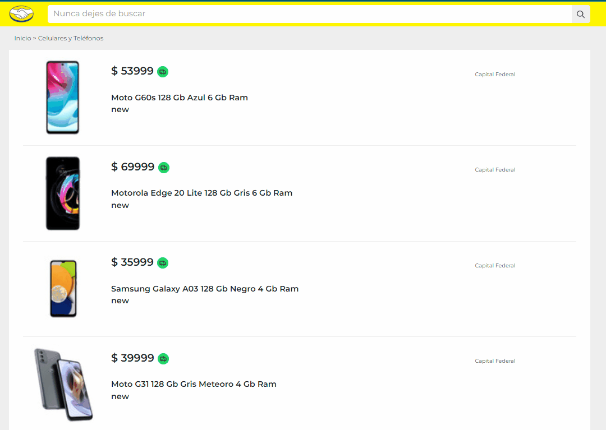
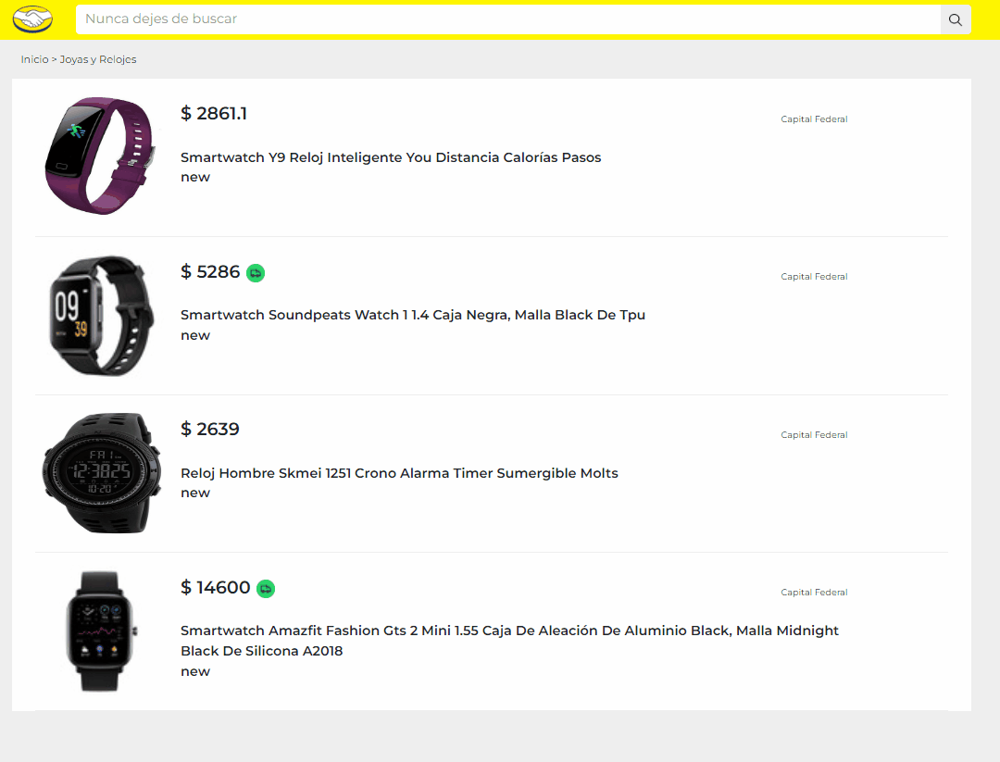

# Desafio Practico Frontend MELI

### `Realizado por Néstor Gomez`

Para correr que el proyecto debemos:

- Ejecutar dentro de la carpeta [desafio-meli/server] > [npm run dev] para correr el servidor.
- Ejecutar dentro de la carpeta [desafio-meli] > [npm start] para correr el cliente.

  El servidor corre en el puerto 8080

Herramientas utilizadas del lado del backend:

- Express {Montaje del servidor}
- Node {Entorno de ejecución}
- Axios {Peticiones a la API de MELI}
- Dotenv {Para generar las variables de entorno}
- Express-validator { se hizo un pequeño middleware para validar que la id del producto empiece con "MLA"}

Herramientas utilizadas del lado del cliente:

- React {Libreria Front-end}
- React-Redux Toolkit {Manejo del estado global de la aplicación}
- React-bootstrap {Maquetado}
- Axios {Peticiones al servidor}
- Sass {Estilos}

### `CREAR UN ARCHIVO .ENV EN LA CARPETA SERVER CPN LOS SIGUIENTES VALORES`

URLMELI=https://api.mercadolibre.com
PORT=8080

EJEMPLO: BUSCAR PRODUCTO

EJEMPLO: MOSTRAR PRODUCTO

EJEMPLO: RESPONSIVE

